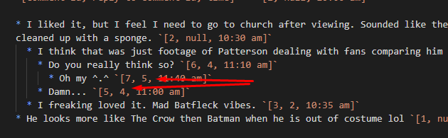

# NodeJS Take home test task

# Setup

- Install packages with `npm i`
- Create `.env` file with `PORT` and `MONGO_SERVER` values corresponding to your environment.
- Start sever with `npm start`

# Test

`npm test`

# Found some inconsistencies

1. 
   I believe these comments should be swapped in terms of parentId.
1. `_id` or `id` field name. Such contracts should be strictly defined across the entire project.
1. ThreadId is UUID, but CommentId is ObjectId. I'd suggest to use UUIDs everywhere.

# Notes and thoughts

- Nest and the project structure is okay. And because it is very small I don't really see the need to change anything right now.
- `@Type(() => Number)` workaround took me a while, looks like [number transforms are still not fixed](https://github.com/typestack/class-transformer/issues/179).
- Cannot really separate business and database logic e.g. with `declined`
- The solution should scale well with mongo replicas because we're sending ton of db requests.
- Also caching could be introduced. E.g. it should be possible to save entire thread tree snapshot at the specific date and then only patch it with the new data.

# Security considerations

- [x] Moderator can only update `status` field to `approved` or `declined`
- [x] Skip & limit query parameters are constrained to `int`

# TODO

1. [x] Build an API to get specific comment and all nested replies
1. [x] Each comment should have moderation status. Default value for new comments - pending (available statuses: pending, approved, declined)
1. [x] Build an API to update moderation status of a comment
1. [x] Build an API to retrieve comments per specific thread.
   1. [x] Endpoint should contain skip & limit parameters.
   1. [x] Endpoint should return specified limit of root comments and all nested replies to each of root comment.
   1. [x] Root comments and replies should be sorted. For more datails about sort see the section - Comments sort explanation.
   1. [x] Comments with declined status should not be returned from this API.
   1. [x] Replies that are left to comments with declined status should not be returned.
1. [x] Add some tests
